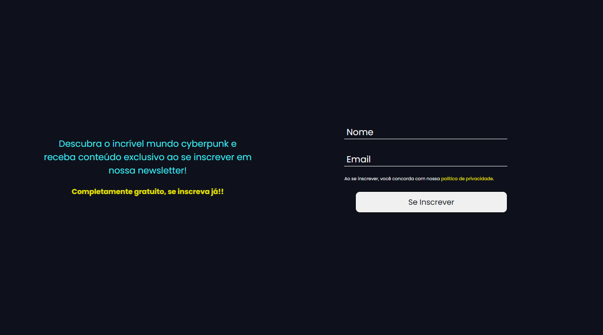

<h1 align="center">Newsletter CyberPunk 🟪</h1>

<h3>Descrição do Projeto</h3>

Criação de uma "newsletter" onde pessoas podem se cadastrar para ficarem informadas sobre o universo do subgênero cyberpunk.

<h3>Tecnologias Usadas</h3>

- HTML e CSS

Fiz somente a parte visual, estou estudando um pouco mais sobre as propriedades do CSS.